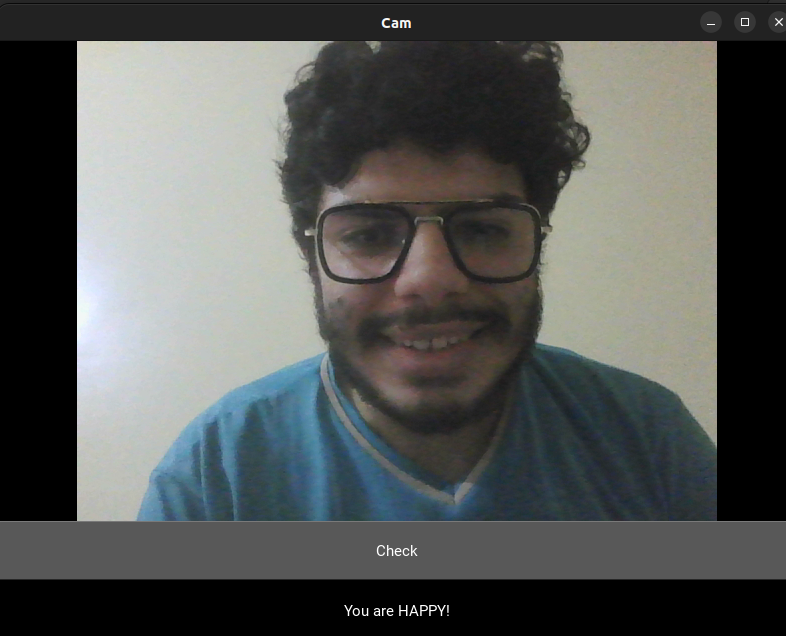
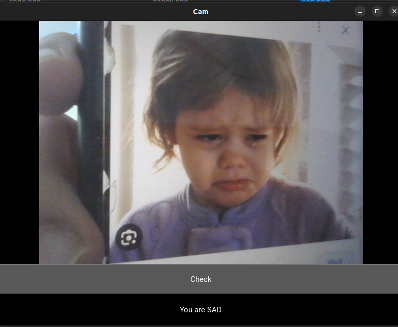
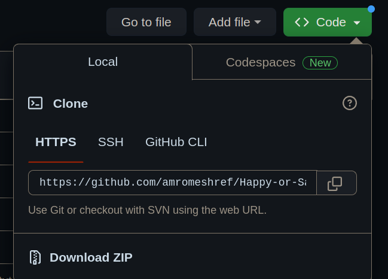

# Happy/Sad Classifier


#### Description:

- I created an app that classifies happy and sad humans.
- The app takes an input image from a webcam then it classifies it.
  
<div align="center">

</div>

<div align="center">

</div>


### Table of Contents
- [Data Collection](#Data-Collection)
- [How to Install](#how-to-install)


## Data Collection

- I collected images from two databases: Facial Expressions Training Data, and Google Images.
- You can download the data I used from: https://www.kaggle.com/datasets/amromeshref/happy-or-sad-classifier

- Facial Expressions Training Data:
    - I collected only happy and sad images from this data set.
    - Download Link: https://www.kaggle.com/datasets/noamsegal/affectnet-training-data
- Google Images:
    - I just searched for happy and sad images and downloaded them.

## How to Install
1. Create a directory in your device.
2. Click on "<> Code"
   
<div align="center">

</div> 

3. Copy the url of this repository.
   
<div align="center">

</div> 

4. Go to the directory you created and type this command to clone this repository:
    ```bash
    git clone "url you copied"
    ```
5. Open the "Happy-or-Sad-Classifier" folder.
6.  Type the following command to install the requirements file using pip:
    ```bash
    pip install -r requirements.txt
    ```
7.  Type the following command to run the app:
    ```bash
    python3 app.py
    ```  
